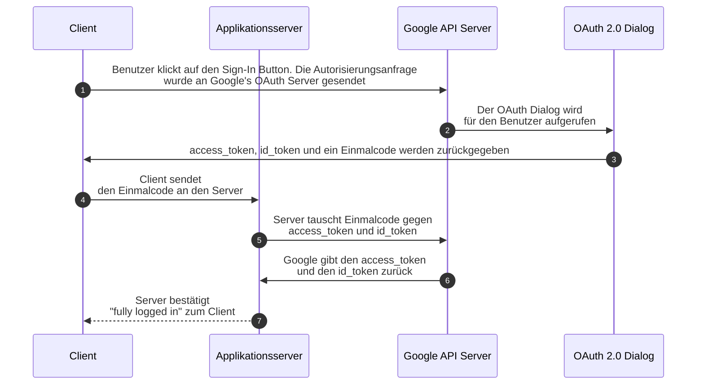

# Key concept: Google IdP  
Mithilfe des Google Sign-In wird ein SSO ermöglicht. Das bedeutet, dass die Benutzer unsere Anwendung ihr Google-Konto zur Authentisierung verwenden können. Dadurch sind keine gesonderten Zugangsdaten für unsere Anwendung nötig. Dadurch wird die User Experience verbessert und demzufolge die Akzeptanz gegenüber den Benutzern unserer Anwendung. [Mehr Informationen](https://developers.google.com/identity/sign-in/web/server-side-flow)

Der Austausch der Daten zwischen den einzelnen Beteiligten erfolgt über das Hypertext Transfer Protocol (HTTP).