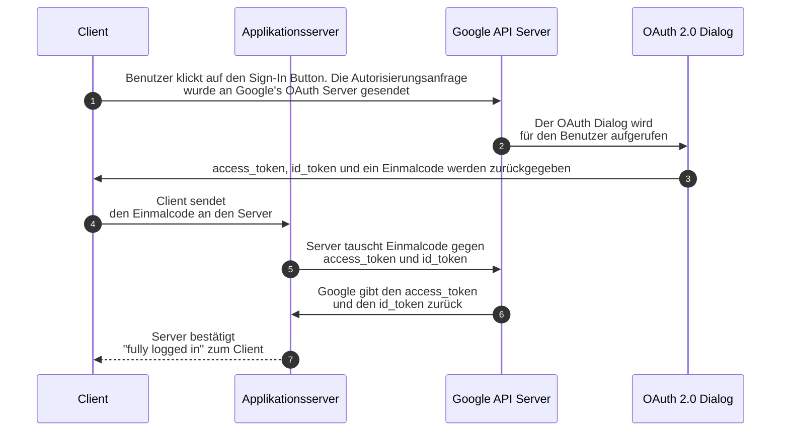

# Key concept: Google IdP  
Mithilfe des Google Sign-In wird ein SSO ermöglicht. Das bedeutet, dass die Benutzer unsere Anwendung ihr Google-Konto zur Authentisierung verwenden können. Der Einsatz von SSO schafft viele Vorteile:

- Die einmalige Anmeldung für den Zugriff auf verschiedene Anwendungen spart Zeit.
- Die Qualität der Zugangsdaten verbessert sich.
- Autorisierungsdienste nutzen sichere Prüfverfahren.
- Die Akzeptanz des Authentisierungsvorgangs steigt.
- Die Benutzerfreundlichkeit für Mitarbeiter wächst.
- Reduzierung der Anmeldungen und Anmeldedaten sorgen für mehr Sicherheit.

Diese Vorteile verbessern die User experience der Benutzer und können die Sicherheit unserer Anwendung verbessern.

Der Austausch der Daten zwischen den einzelnen Beteiligten erfolgt über das Hypertext Transfer Protocol (HTTP).  [Mehr Informationen](https://developers.google.com/identity/sign-in/web/server-side-flow)